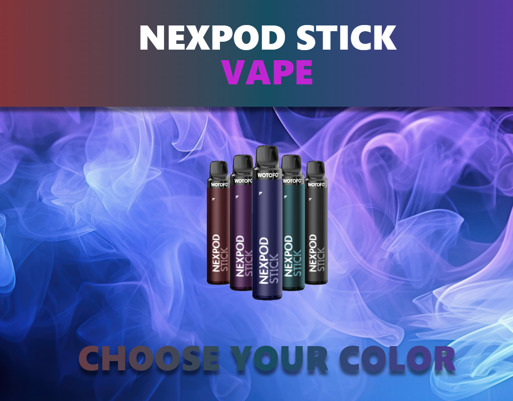

# Vape Product Section

## Description

This work it's a product prototype for vapes and relates.

## Deploy

[Deploy](https://product-vaper.netlify.app/)



## How To Use

To clone and run this application, you'll need [Git](https://git-scm.com) and [Node.js](https://nodejs.org/en/download/) (which comes with [npm](http://npmjs.com)) installed on your computer. From your command line:

```bash
# Clone this repository
$ git clone https://github.com/product-vaper

# Go into the repository
$ cd product-vaper

# Install dependencies
$ npm install

# Run the app
$ npm run dev
```
